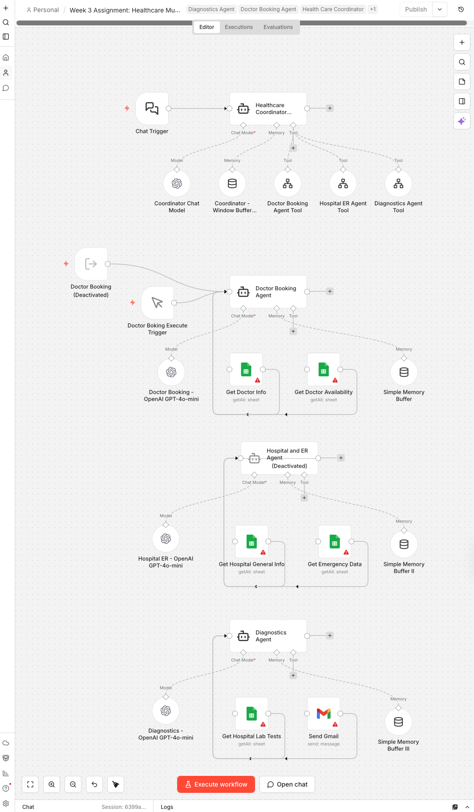

# Healthcare Multi-Agent System

> **Applied Agentic AI Program · Interview Kickstart · Spring 2026**  
> Lamonte Smith


---
A conversational **multi-agent AI system** built in n8n that orchestrates three specialized healthcare agents — Doctor Booking, Hospital & ER, and Diagnostics — through a central Coordinator Agent. Powered by GPT-4o and GPT-4o-mini, backed by five live Google Sheets datasets covering 3,400+ hospitals, 28 doctors across 12 specialties, and 8 diagnostic test types.

---

## System Architecture

```
User (Chat Interface)
        │
        ▼
┌────────────────────────────────────────┐
│        Healthcare Coordinator          │
│           (GPT-4o)                     │
│  • Intent classification               │
│  • Multi-intent routing                │
│  • Window Buffer Memory (10 turns)     │
│  • Seamless agent orchestration        │
└────┬──────────────┬────────────────────┘
     │              │              │
     ▼              ▼              ▼
┌─────────┐  ┌───────────┐  ┌────────────┐
│ Doctor  │  │ Hospital  │  │Diagnostics │
│ Booking │  │  & ER     │  │   Agent    │
│  Agent  │  │  Agent    │  │(GPT-4o-mini│
│(GPT-4o- │  │(GPT-4o-   │  │            │
│  mini)  │  │  mini)    │  │            │
└────┬────┘  └─────┬─────┘  └─────┬──────┘
     │             │              │
  ┌──┴──┐    ┌─────┴──────┐  ┌───┴──────────┐
  │ 📋  │    │     🏥     │  │      🔬      │
  │ Dr  │    │  Hospital  │  │  Lab Tests   │
  │Info │    │  General   │  │   Dataset    │
  │ 📅  │    │    Info    │  │  ✉️ Gmail    │
  │ Dr  │    │  🚨 ER &   │  │  (prep docs) │
  │Avail│    │ Emergency  │  │              │
  └─────┘    └────────────┘  └──────────────┘
```

---

## Agents

### Healthcare Coordinator Agent
- **Model:** GPT-4o (coordinator-tier)
- **Role:** Primary user interface — classifies intent and routes to specialist agents
- **Memory:** Window Buffer Memory — 10-turn conversation context
- **Capability:** Multi-intent routing — can dispatch to multiple agents simultaneously and synthesize a unified response
- **Routing logic:** Doctor queries → Doctor Booking Agent · Hospital/ER queries → Hospital & ER Agent · Diagnostic queries → Diagnostics Agent

### Doctor Booking Agent
- **Model:** GPT-4o-mini
- **Datasets:** Doctor Info · Doctor Availability
- **Capabilities:**
  - Find doctors by specialty across 12 medical specialties
  - Check real-time appointment availability (March 1–7, 8:00 AM–5:30 PM, 30-min slots)
  - Book and confirm appointments
  - Provide doctor contact information
- **Specialties:** Nephrology · Orthopedics · Ophthalmology · Cardiology · Radiology · Gynecology · Pediatrics · Psychiatry · Pulmonology · Endocrinology · Dermatology · Oncology

### Hospital & ER Agent
- **Model:** GPT-4o-mini
- **Datasets:** Hospital General Info (3,401 hospitals) · Hospital Emergency Data (32 ER locations)
- **Capabilities:**
  - Find hospitals by name, city, or state
  - Compare quality ratings (1–5 stars) across mortality, safety, readmission, and patient experience metrics
  - Locate emergency rooms with ambulance availability by ZIP code
  - Report on CMS quality metrics
- **ER Coverage:** NYC · DC · Atlanta · Miami · Chicago · New Orleans · Austin · Phoenix · LA · SF Bay Area · Seattle

### Diagnostics Agent
- **Model:** GPT-4o-mini
- **Datasets:** Hospital Lab Tests · Health Packages
- **Capabilities:**
  - Provide preparation instructions for 8 diagnostic test types
  - Surface health package options (Cancer Screening, Diabetes Management, Heart Care, Orthopedic, Women's Wellness, Full Body Checkup)
  - Email test prep instructions to patient via Gmail integration
  - Identify hospitals offering specific tests

---

## Datasets (5 Google Sheets)

| Dataset | Records | Coverage |
|---------|---------|----------|
| Doctor Info | 28 doctors | 12 specialties |
| Doctor Availability | Appointment slots | March 1–7, 30-min intervals |
| Hospital General Info | 3,401 hospitals | Nationwide — CMS quality metrics |
| Hospital Emergency Data | 32 ER locations | 13 major metro ZIP codes |
| Hospital Lab Tests | 8 test types | Prep instructions + health packages |

---

## Tech Stack


**Models:** GPT-4o (coordinator) · GPT-4o-mini (specialist agents)  
**Integrations:** Google Sheets (5 datasets) · Gmail (email delivery)  
**Patterns:** Coordinator-Worker · Multi-Intent Routing · Tool-as-Agent · Window Buffer Memory

---

## Workflow Features

- **Seamless UX** — internal agent names never exposed to the user
- **Multi-intent handling** — single query can trigger multiple agents simultaneously
- **Persistent memory** — 10-turn context window per session on the coordinator
- **Graceful fallback** — off-topic queries politely redirected
- **Email integration** — diagnostic prep instructions deliverable via Gmail

---

## Sample Queries

```
"Find me a cardiologist available Monday morning"
"Which hospitals near ZIP 60601 have 5-star ratings and ambulance availability?"
"What do I need to do to prepare for an MRI?"
"Book an appointment with a pediatrician and email me the confirmation"
"Compare the top-rated hospitals in Michigan"
```

---

## Academic Context

| Field | Detail |
|-------|--------|
| Program | Applied Agentic AI |
| Institution | Interview Kickstart |
| Semester | Spring 2026 |
| Assignment | Week 3 — Multi-Agent Orchestration |

---

## Repository Structure

```
healthcare-multi-agent/
├── workflow/
│   └── Healthcare_Multi_Agent_System_Combined.json   # n8n export
├── docs/
│   └── agent-routing.md                              # Routing logic detail
├── SECURITY.md
└── README.md
```

---

## Security Notes

- All Google Sheets credentials managed via n8n credential store — never hardcoded
- Gmail integration uses OAuth2 — no plaintext passwords
- Dataset IDs are referenced by n8n internal ID — not exposed in workflow logic
- See [SECURITY.md](SECURITY.md) for full policy

---

## License

MIT License — see [LICENSE](LICENSE)

---

<div align="center">
<sub>Built by <a href="https://github.com/LSmithPMP">Lamonte Smith</a> · Applied Agentic AI · Interview Kickstart</sub>
</div>
